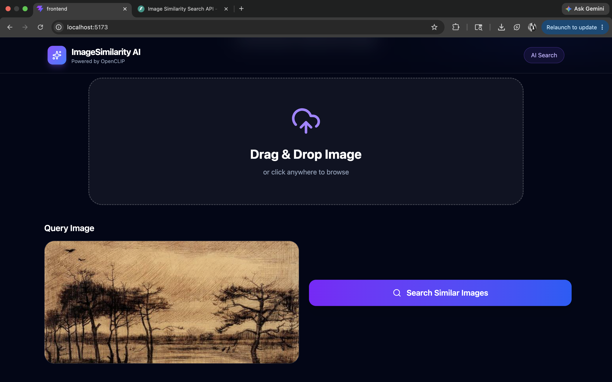
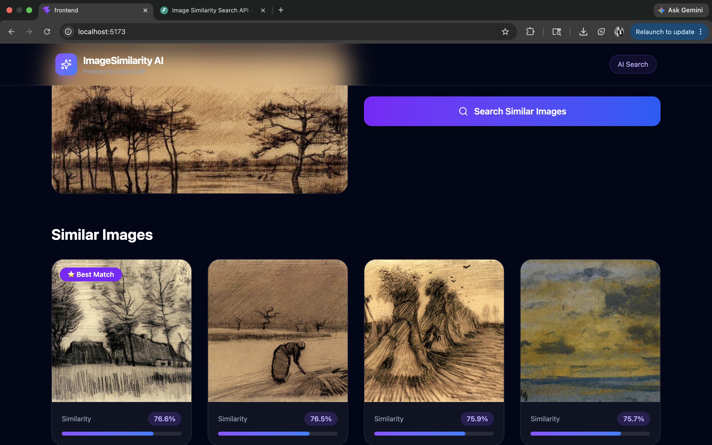

# 🖼️ Image Similarity Search

An AI-powered Image Similarity Search application that retrieves visually similar images using **OpenCLIP embeddings** and **Cosine Similarity**. The project consists of a **FastAPI backend**, a **React frontend**, and is fully containerized using **Docker**.

---

## 📖 Project Overview

Image Similarity Search is a computer vision application that allows users to upload an image and retrieve the **Top 5 visually similar images** from a dataset. Instead of comparing filenames or metadata, the application compares the **visual features** of images using embeddings generated by OpenCLIP.

---

## 🎯 Objectives

- Develop an AI-powered image similarity search engine.
- Generate image embeddings using OpenCLIP.
- Compare embeddings using cosine similarity.
- Build a modern and responsive web interface.
- Deploy the application using Docker.

---

## ✨ Features

- 📤 Upload an image from your device
- 🧠 Feature extraction using OpenCLIP (ViT-B-32)
- 🔍 Retrieve the Top 5 visually similar images
- 📊 Display cosine similarity scores
- 🎨 Modern React frontend with drag-and-drop support
- ⚡ FastAPI REST API backend
- 🐳 Docker & Docker Compose support

---

## 🛠️ Tech Stack

### Backend
- Python
- FastAPI
- OpenCLIP
- PyTorch
- NumPy
- Scikit-learn
- Pillow

### Frontend
- React
- Vite
- Tailwind CSS
- Framer Motion
- Lucide React

### Tools
- Docker
- Docker Compose
- Git
- GitHub

---

## 📂 Project Structure

```text
ml-image-similarity/
│
├── dataset/
│
├── embeddings/
│   ├── embeddings.npy
│   └── image_paths.pkl
│
├── frontend/
│   ├── src/
│   ├── public/
│   ├── Dockerfile
│   └── package.json
│
├── src/
│   ├── app.py
│   ├── embed.py
│   ├── model.py
│   └── search.py
│
├── uploads/
├── Dockerfile
├── docker-compose.yml
├── requirements.txt
├── README.md
└── .gitignore
```

---

## 🧠 Model Used

**OpenCLIP**

- Model: **ViT-B-32**
- Pretrained Weights: **laion2b_s34b_b79k**

The model converts every image into a high-dimensional feature vector (embedding). Images with similar visual content produce similar embeddings, enabling efficient similarity search.

---

## ⚙️ How It Works

1. Generate embeddings for all images in the dataset.
2. Store the embeddings locally.
3. Upload a query image.
4. Generate an embedding for the uploaded image.
5. Calculate cosine similarity between the query embedding and stored embeddings.
6. Sort the similarity scores.
7. Display the **Top 5 most similar images**.

---

## 📊 Similarity Metric

The application uses **Cosine Similarity** to compare image embeddings. Images with higher similarity scores are considered more visually similar.

---

## 🚀 Installation

### Clone the Repository

```bash
git clone https://github.com/Ashirvad007/ml-image-similarity.git

cd ml-image-similarity
```

---

### Backend Setup

```bash
python -m venv venv

source venv/bin/activate

pip install -r requirements.txt
```

---

### Frontend Setup

```bash
cd frontend

npm install
```

---

## ▶️ Run the Application

### Start Backend

```bash
uvicorn src.app:app --reload
```

Backend:

```
http://localhost:8000
```

API Documentation:

```
http://localhost:8000/docs
```

---

### Start Frontend

```bash
cd frontend

npm run dev
```

Frontend:

```
http://localhost:5173
```

---

## 🐳 Run with Docker

Build and start the application:

```bash
docker compose up --build
```

Stop the application:

```bash
docker compose down
```

---

# 📷 Screenshots

## 🏠 Home Page

The landing page of the application where users can upload an image to perform a similarity search.


---

## 📤 Upload Image

Users can drag and drop or browse to upload an image. A preview of the selected image is displayed before performing the search.



---

## 🔍 Search Results

After processing the uploaded image, the application displays the **Top 5 visually similar images** along with their cosine similarity scores.



---

## 🌟 Future Enhancements

- Integrate FAISS for faster similarity search.
- Support multiple embedding models.
- Add user authentication.
- Deploy to cloud platforms.
- Enable batch image search.
- Maintain search history.

---

## 👨‍💻 Author

**Ashirvad Janardanan**

B.Tech Computer Science Engineering (Artificial Intelligence & Machine Learning)

GitHub: **https://github.com/Ashirvad007**

---

## 📜 License

This project was developed as part of an internship assignment for educational purposes.